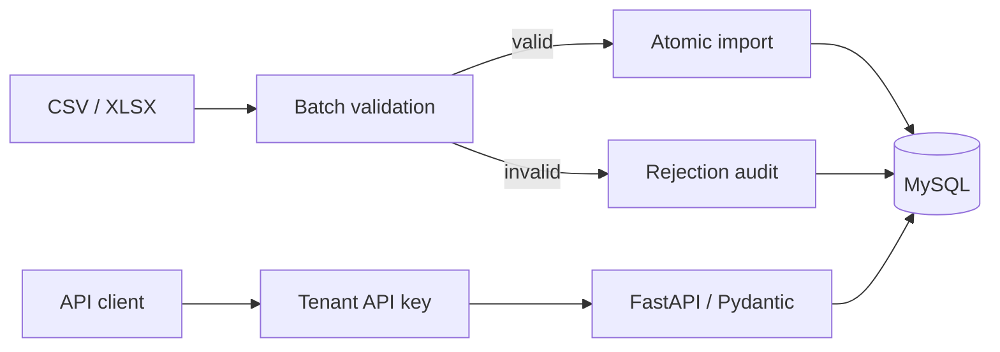

# Architecture

RunnerX combines a tenant-authenticated HTTP API and an administrative import CLI over one MySQL schema.

## Data model

- Tenants own runners and bootcamps; registrations join them. Groups belong to a bootcamp, and training sessions reference a registration.
- Composite foreign keys enforce tenant and bootcamp ownership, including group assignments.
- UUIDs identify records. Runner `external_id` is case-sensitive and unique per tenant; names are editable attributes.
- Each runner has at most one training session per bootcamp and calendar date.

## Writes

The CLI validates the complete import before writing business records and its audit in one transaction. Rejected batches write only an audit; dry runs write nothing. Changed files update matching business keys, preserving blank optional fields. API PATCH accepts explicit null for nullable fields.

Imports and date-dependent API writes lock the bootcamp row. Connections use READ COMMITTED isolation; unique constraints resolve remaining identity conflicts. Callers own commit/rollback.

## Reads and runtime

API queries filter by authenticated tenant. Pagination uses stable ordering and a maximum page size of 100. Composite indexes support tenant, bootcamp and date filters; MySQL computes counts and distance aggregates.

API keys are random bearer credentials stored as SHA-256 digests. The CLI creates and revokes keys using direct database access.

Docker Compose runs MySQL, an Alembic migration service and FastAPI; the API starts after migrations succeed. See [Docker operations](docker-guide.md) and the [optional GCP reference](deployment.md).
