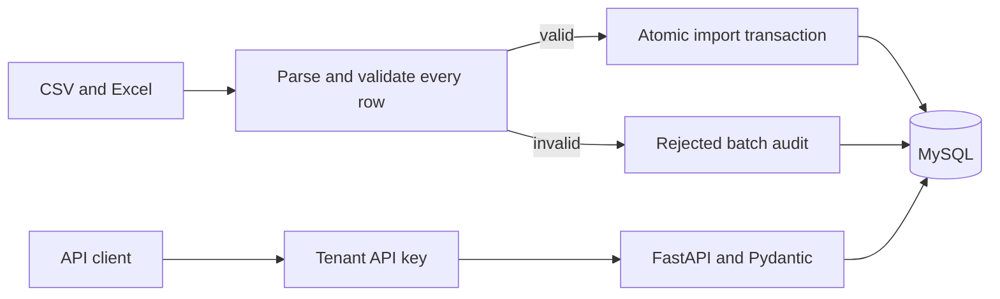

# Architecture

RunnerX is one Python application with two entry points: a trusted offline administrative CLI and an HTTP API authenticated by tenant API keys. Both use the same relational schema.

## Ownership and identity

A tenant owns runners and bootcamps. Registration joins a runner to a bootcamp; a group belongs to that same bootcamp. Training records reference an existing registration. Composite foreign keys include tenant and bootcamp IDs, so a direct database write cannot associate another tenant's runner or a different camp's group.

UUIDs are internal keys. `external_id` is the stable, case-sensitive runner identifier supplied by the source system, unique per tenant. Names are ordinary editable attributes. There is one session per runner/camp/calendar date in v0.1; multiple same-day workouts would require a future schema change.

## Transactions and concurrency

The CLI owns commit/rollback. The importer first parses and validates the complete batch, then writes business records and its audit in one transaction. Rejected imports write an audit only. Dry runs never flush or create audits. Missing optional values on a corrected import preserve existing values; use API PATCH with explicit null to clear nullable fields.

Imports lock their bootcamp row. API operations that change date-dependent data use the same camp lock. Database connections use READ COMMITTED so queries after waiting on a lock see committed changes. Unique constraints remain the final defense against concurrent identity conflicts; a database failure rolls back the operation and the CLI reports failure.

## Query and deployment scope

Pagination is bounded to 100 rows, with stable ordering. Composite indexes support tenant/camp/date access. Counts and distance aggregation execute in MySQL. No throughput target has been measured for this release.

Local Docker Compose separates database, migration and API lifecycle. GCP uses Cloud SQL and Cloud Run, with a separate migration job. Migration changes must remain compatible with the previous application revision during rollout. The cloud workflow tests a candidate revision before moving existing traffic; this is not a guarantee of zero downtime.

API keys are random bearer credentials stored as SHA-256 digests. The CLI can create/list/revoke them. The CLI is a trusted administrative surface with database access, not a public tenant endpoint. Production disables documentation by default and the provided Cloud Run configuration additionally requires IAM authentication.
